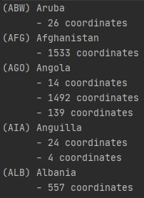
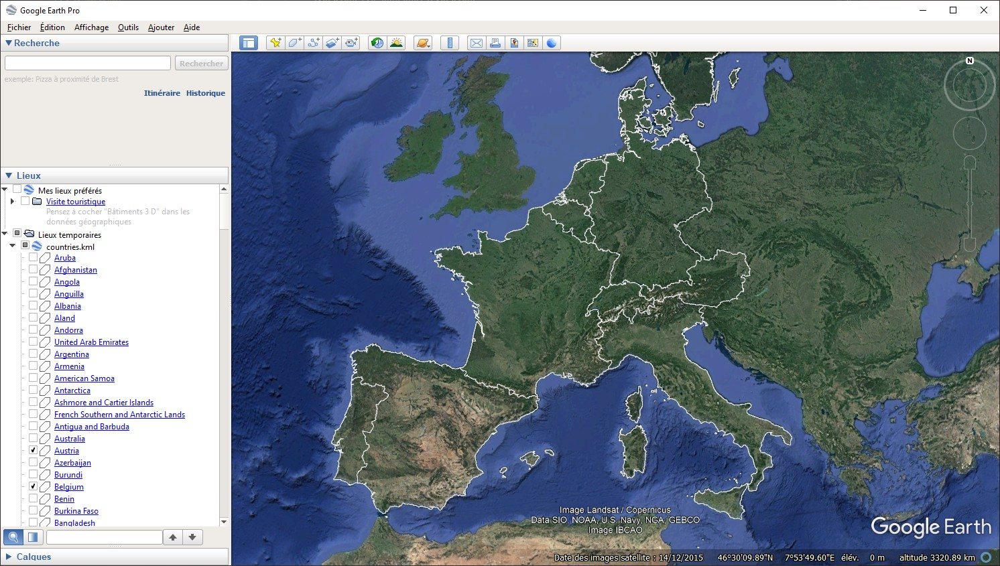

# HEIG-VD - SER - Rapport Laboratoire 3 - GeoJSON à KML
## Auteurs
Arthur Bécaud et Nenad Rajic
## Classes Java

Le projet se compose de deux classes ( `GeoJSONReader` et `KMLWriter` ) pour _parser_ les données, de trois autres classes pour stocker les données GeoJSON en mémoire ( `Country`, `Polygon` et `Coordinate` ) et d'une interface pour permettre au trois classes précédentes de générer elle-même leur format KML ( `FormattableToKML` ).

En plus de cela s'ajoute des classes de test pour vérifier le fonctionnement du projet et une classe `Main` pour utiliser les _parsers_.
### Classes de stockage de données
#### Coordinate
La classe `Coordinate` permet de stocker deux coordonnées x y d'un plan à deux axes.
#### Polygon
La classe `Polygon` permet de stocker une liste de coordonnées pour former un polygone.
#### Country
La classe `Country` permet de stocker un nom _admin_, une abréviation du nom _iso_a3_ et un polygone formant les bordures d'un pays.
### Interface FormattableToKML
L'interface `FormattableToKML` comprend une méthode `toKML()` retournant une instance `org.jdom2.Element`. Cette méthode permet à une classe de se formater elle même  à un format KML et d'en retourner le résultat.
### Parser
#### GeoJSONReader
La classe `GeoJSONReader` permet de _parser_ un fichier `GeoJSON` pour obtenir une liste de pays ( `List<Country>`  ).

**Fonctionnement :**

Le _parser_ utilise la librairie `com.googlecode.json-simple` pour lire toutes les _feature_ du fichier `GeoJSON`.

Pour chaque _feature_ le _parser_ fait les tâches suivantes :
1. Récupère les propriétés `ADMIN` et `ISO_A3` et les coordonnées de l'objet _goemetry_.
2. Avec les coordonées récupérées, créé un ou plusieurs polygones (instance de la classe `Polygon`) dans une liste nommée `borders` selon le type de l'objet _geometry_ (type: _Polygon_ ou _MultiPolygon_).
3. Créé un pays (instance de la classe `Country`) avec les propriétés `ADMIN` et `ISO_A3` ainsi que la liste des bordures nommée `borders`.

Une fois toutes les _features_ _parser_, retourne la liste des pays.

**Utilisation :**
1. Créer une instance de la classe avec comme paramètre le chemin vers un fichier au format `GeoJSON`.
2. Utiliser la méthode `parse` pour _parser_ ce fichier afin de générer et retourner une liste de pays ( `List<Country>` ) correspondant au contenu du fichier.

#### KMLWriter
La classe `KMLWriter` permet de générer un fichier _KML_ à partir d'une liste de pays ( `List<Country>` ).

**Fonctionnement :**

Le _writer_ utilise la librairie `org.jdom2` pour écrire le fichier _KML_.

Le _writer_ commence par créé une balise `kml` qui servira de balise racine du fichier. Elle y ajoute ensuite une balise `Document`, enfant de `kml`, qui contiendra toutes les informations des pays.

S'ajoute ensuite une balise de style pour les polygons _kml_ comme enfant de la balise `Document`.

Puis pour chaque pays le _writer_ utilise l'interface `FormattableToKML` pour obtenir une instance de `org.jdom2.Element` qui contiendra une balise `Placemark` avec toutes les informations dudit pays dans un format _kml_ adéquat. Ce résultat est ensuite ajouté comme nouvel enfant de la balise `Document`.

Une fois que tous les pays sont ajoutés à la balise `Document`, le _writer_ créé le nouveau fichier et utilise `org.jdom2.output.XMLOutputter` pour écrire le contenu du fichier avec la balise racine _kml_.

**Utilisation :**

1. Créer une instance de la classe avec comme paramètre le chemin de destination du fichier au format `KML` et une liste de pays ( `List<Country>` ).
2. Utiliser la méthode `write` pour écrire le fichier _KML_ correspondant à la liste de pays donnée.

## Difficultés rencontrées
Nous avons rencontré aucune difficulté particulière durant ce travail. Certaines parties du projet furent complexes comme l'analyse de la structure _GeoJSON_ ou la recherche du format _KML_ mais rien de transcendant finalement.
## Problème connu
Il existe un problème connu avec la librairie `com.googlecode.json-simple` qui cause une perte de précision des coordonnées. La librairie va automatiquement convertir les valeurs trouvées dans le fichier _geojson_ au format le plus approprié. Les coordonées sont ainsi convertis en _Double_ causant cette perte de préscision dans certains cas. Ceci est dû à la façon dont la librairie parse les données.

Ce problème n'a finalement pas un grand impact sur le résultat car la perte de précision arrive à partir de la 15ème décimale.

## Résultat du _parsing_ du fichier GeoJSON
Voici une partie du résultat du _parsing_ du fichier _GeoJSON_.   

Vous pouvez obtenir la version complète dans le fichier `resultat_parsing.txt` ou en exécutant la classe `Main`.
## Résultat sur Google Earth

## _Apprentissages ?_
**-- TODO --**
## Conclusions
**-- TODO --**
